# Linux 101 Solutions

## Exercise 1
  - [X] What is the difference between `cat` and `touch` commands.
    - The `touch` command is used to create an EMPTY file (where the file storage is 0 bytes of memory, meaning that we cannot insert any data into the file with this command)  while the `cat` also creates a file but allows the insertion of content into it as well as reading and displaying its content.
  
  - [X] Create a file using the `cat` and the `touch` commands.
    - With `cat`:
    - 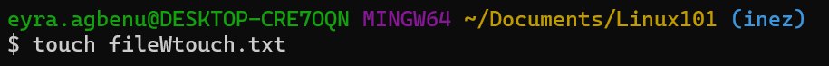
    - With `touch`:
    - 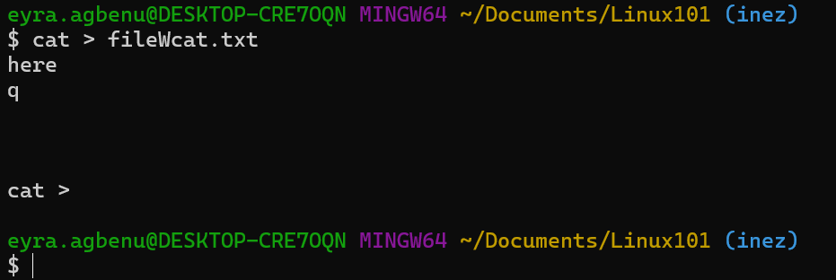

  - <details open>
    <summary> THE CAT COMMAND</summary>
    <ul>
    <li>Display file contents: cat filename.txt</li>
    <li>Create a new file and add content to it: cat > newfile.txt</li>
    <ul>
    <li>This is the content of the new file. [Press Ctrl + D to save and exit]</li>
    </ul>
    <li>Concatenate MULTIPLE FILES: combining multiple files into one</li>
    <ul>
    <li>cat file1.txt file2.txt > combined.txt</li>
    </ul>
    </details>

## Exercise 2: 
  - [X] What are `file permissions` in linux and what are the various ways of displaying the file permissions in linux?
    - In Linux file permissions are restrictions that control whether a user has access to perform actions like Read, Write, and Execute for every file specified.
    - The various ways (two ways) to display file permissions in Linux are:
      - with the `ls` command: ls -l [filename]
      - with the `stat` command: stat [filename]

  - [X] What is the default `permissions` given to a file when its created?
    - Access: (0644/-rw-r--r--) where the owner can read and write to the file, members of the group the file is in can read the file and others can also read the file.
  - [X] What is the default `permissions` given to a folder when its created?
    - Access: (0755/drwxr-xr-x)
  - [X] How do you create `a folder` in linux.
    - You use the `mkdir` command --like how I used to create the images folder.
    - 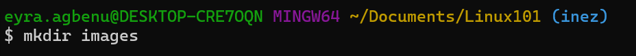

## Exercise 3
  - [X] Firstly, research and find the command used to print the number of lines, words and characters in a file.
    - It is the `wc` (word count) command. It counts the number of lines, words, characters, and bytes of each given file or standard input.
    - command: wc [OPTION]... [FILENAME]...
    - Where the OPTION can be: 
      - `-w`: prints the number of words in a file.
      - `-l`: prints the number of lines present in a file.
      - `-c`: prints the count of bytes present in a file.
      - `-m`: prints the count of characters from a file.
      - `-L`: prints the length of the longest (number of characters) line in a file. (includes space, tab, and newline)
  - [X] Secondly, apply the command to the `animals.txt` file attached to this exercises.
    - 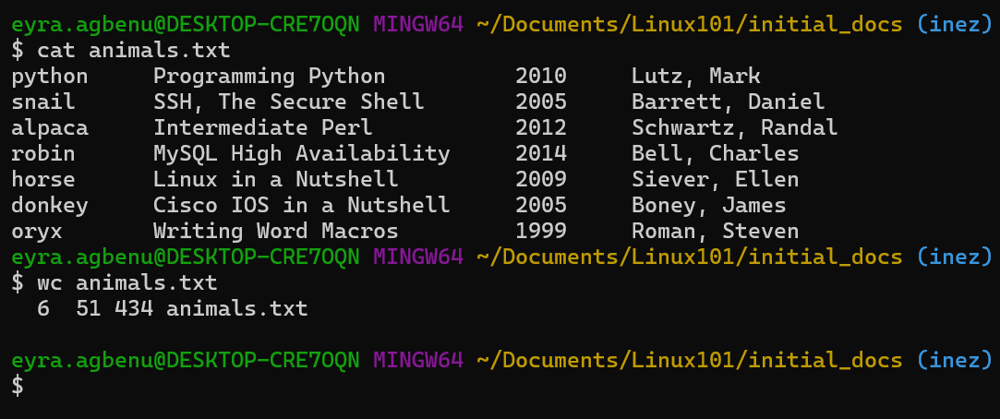

## Exercise 4
  - [X] Using a `linux command`, get the first 3 lines in the `animals.txt`
    - We would use the `head` command here as it displays the beginning portion of a file.(`head` -n 3 filename.txt)
    - 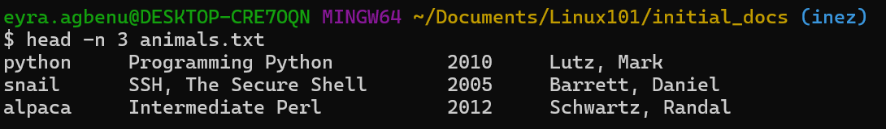
  - [X] In addition to getting the first 3 lines, count only the words within this range.🫣
    - I have tried to combine these two commands on my own for a while but upon finally turning to the *cough* web, I learned that you have to use a `pipe (this symbol: | )` to combine them.
    - Doing this, you get: `head -n 3 animals.txt | wc -w` and here's the result:
    - 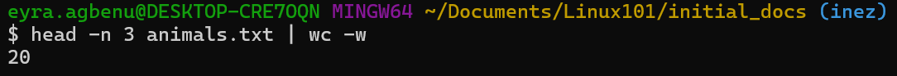

## Exercise 5
  - [X] There is a command in linux that starts with `g`, that has the capability to search through files. What is the `command`?
    - The `grep` (Global Regular Expression Print) command because it searched for patterns (like text or regex) inside files.
    - Command example: grep "pattern" filename.txt
  - [X] Using this command, search for the words, `Nutshell`, `Perl` and `Dansoman` in `animals.txt`
    - 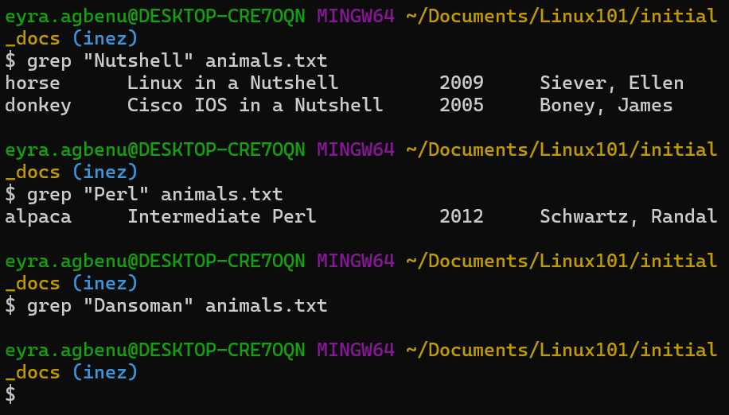

## Exercise 6
  - [X] What `command` is used to list all files in a directory?
    - The `ls`(list) command.
  - [X] Wait a minute....what is a `directory` in linux 😅?
    - A directory is a type of file that serves as a container for other files and folders. In that sense, it's basically a folder.

## Exercise 7
  - [X] What is the `pwd` command what does it do?
    - The `pwd` command stands for **print working directory** and it shows the full path of one's current directory. It essentially shows you where you are in the file system at that moment.
  - [X] What is the difference between `echo` and `cd` command?
    - The `cd` command, which stands for **change directory** is to switch to a different directory either by going the way you came (using `cd ..` to go to the previous folder/directory) or by inserting the path of the directory you want to move to (`cd path/to/another/directory`) while the `echo` command is used to print/display text to the terminal, overwrites specified files or appends content to a file.

## Exercise 8
  - [X] What is the `dirs` command in linux and what does it do? 
    - 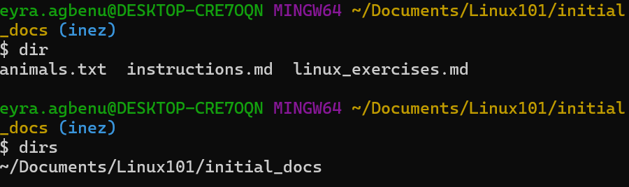
    - The `dirs` command displays the list of directories in the directory stack, showing the folders you've recently navigated to and saved for quick access.
  - [X] I need to find out what the command `mv` does, what command do I need to use to find out more about the `mv` command in linux.
    - You can use `mv --help`, `info mv` or `man mv`

## Exercise 9
  - [x] Using the `date` command, print out the current day in the terminal.
    - the command is: `date +"%A"`
    - 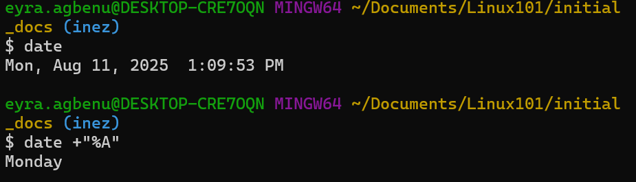
  - [x] What is the difference between `awk` and `grep` commands? Please provide examples.
    - From before (ex.5),`grep` searches and prints lines that match a pattern (word or regex), while `awk` can do that plus process and manipulate specific fields within those lines.
    - `awk` command: `awk 'pattern { action }' filename`
    - Examples:
      - Where `grep` and `awk` perform the same action of finding all words that match "Perl"
      - 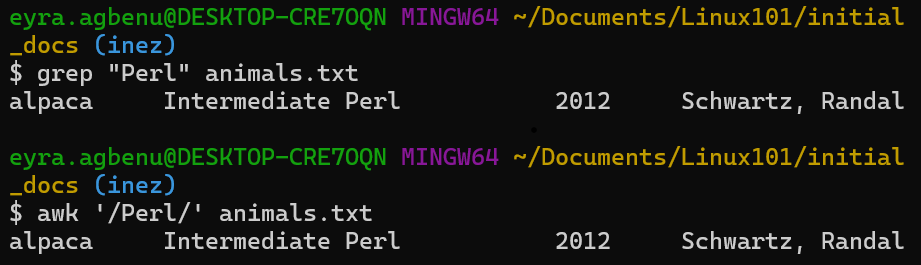
      -  `awk` printing the second column of every line in animals.txt
      -  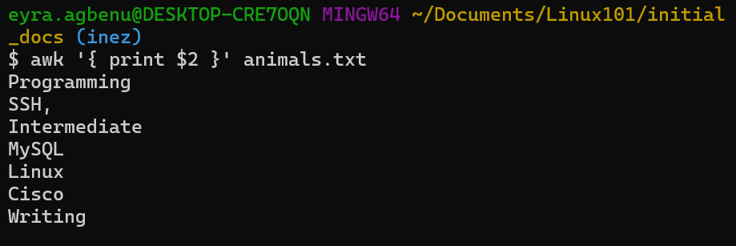

## Exercise 10
  - [X] What are environment variables? List out 5 env variables(There is a command to list them out in your terminal.😜)
    - They are variables, made up of a name/value pair, available to your program dynamically during runtime and their values are set outside the program. 
    - To list them out in the terminal, you use the command: `printenv`
    - Some of them are:
      - PUBLIC=C:\Users\Public
      - SYSTEMDRIVE=C:
      - MSYSTEM_PREFIX=/mingw64
      - TMP=/tmp
      - ORIGINAL_TEMP=/tmp
  - [X] What is the difference between `more` and `less` commands?
    - These are paging commands in Linux, meaning they allow you to view long text one screen at a time.
    - `more` loads the file as you go and only moves in a forward manner while `less` allows you to navigate the lines in both forward and backward manners and it preloads buffer for faster navigation.
    - You should use `less` if you want smoother navigation and better search in long files.

## Exercise 11
  - [x] There is a command in linux for seeing a type of a file in a directory what command is that?
    - That command is `file`

## Exercise 12
  - [x] The Unix system has a filesystem tree what is it called and list 3 important folders in this tree.
    - It's called the `root filesystem`
    - Important folders in this tree:
      - `/bin`, `/etc`, and `/home`

## Exercise 13
  - [x] In unix are 2 commands `head` and `tail`. Kindly illustrate how this is used in the git bash terminal.
    - `head` shows the first few lines of a file while `tail`, being the opposite, shows the last few lines of a file.
    - Say we want the first and last 2 lines of our `animals.txt` file:
      - 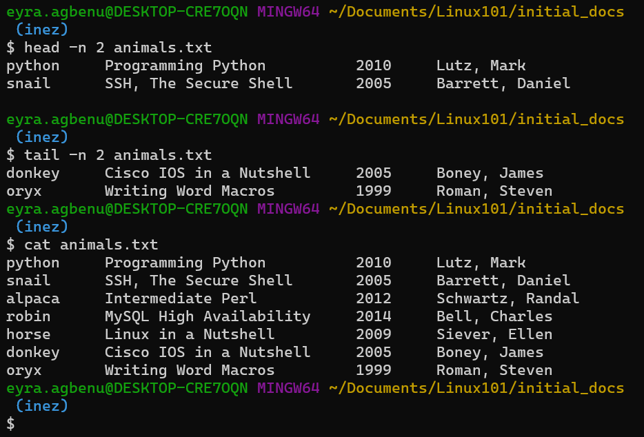

## Exercise 14
  - [x] Create a file called students.txt with the following content:
  ```
    John Doe,Computer Science,3.8
    Jane Smith,Mathematics,3.9
    Bob Johnson,Physics,3.7
    Alice Brown,Computer Science,3.6
  ```
  NB: add screenshots for solutions to the ff questions
  - [x] Display the entire contents of the file
    - 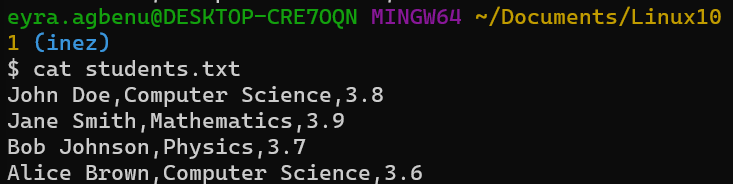
  - [x] Display only the first 2 lines
    - 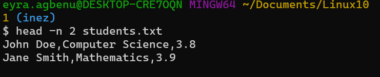
  - [x] Display only the last 2 lines
    - 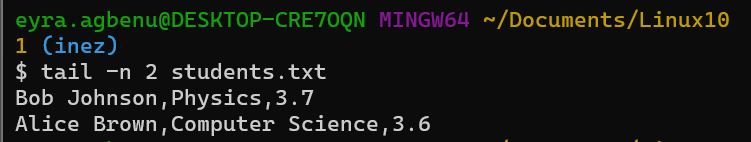
  - [x] Count the number of lines, words, and characters in the file
    - 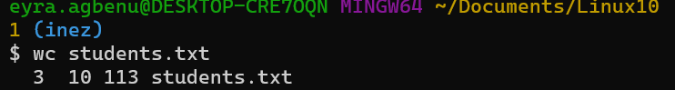
  - [x] Search for all lines containing "Computer Science"
    - 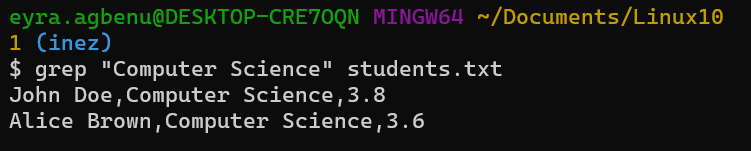
  - [x] Create a new file with only the Computer Science students
    - 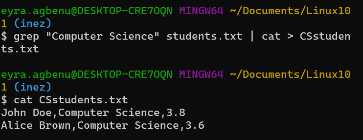
  - [x] Sort the file by GPA (last column)
    - 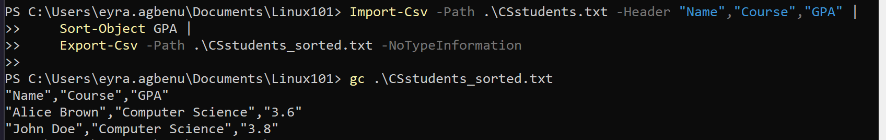
    - I used pwsh because I keep getting an error with the sort function in Git:
    - 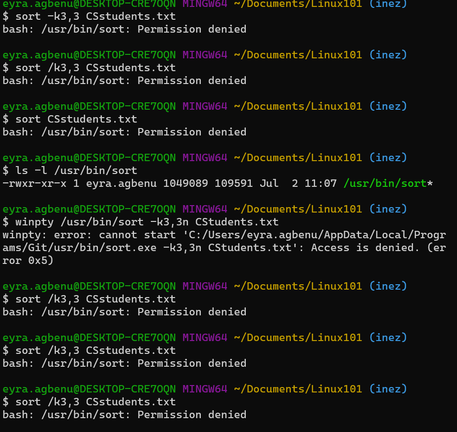
  - [x] Replace all occurrences of "Computer Science" with "CS" and check the final output.
    - 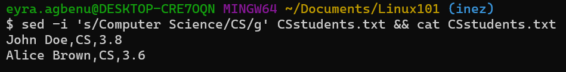

## Exercise 15
  - [X] Create a log file called server.log with this content:
    ```
      2023-01-15 10:30:25 INFO User login successful
      2023-01-15 10:31:15 ERROR Database connection failed
      2023-01-15 10:32:10 INFO User logout
      2023-01-15 10:33:45 WARNING Low disk space
      2023-01-15 10:34:20 ERROR Authentication failed
      2023-01-15 10:35:05 INFO System backup completed
    ```
    NB: add screenshots for solutions to the ff questions
  - [x] Find all ERROR entries
    - 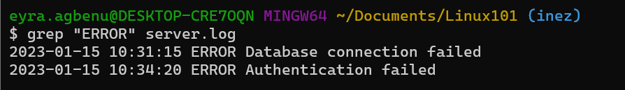
  - [x] Count how many WARNING entries exist
    - 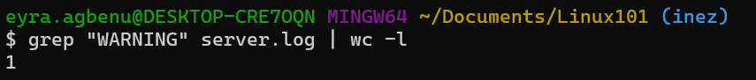
  - [x] Extract all timestamps (first two columns)
    - 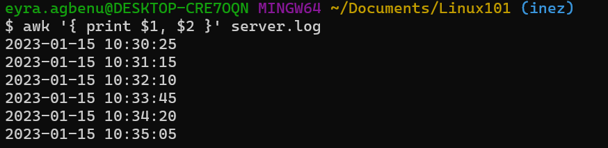
  - [x] Find lines that contain either "login" or "logout"
    - updated with better solution: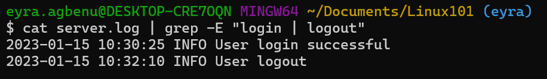 